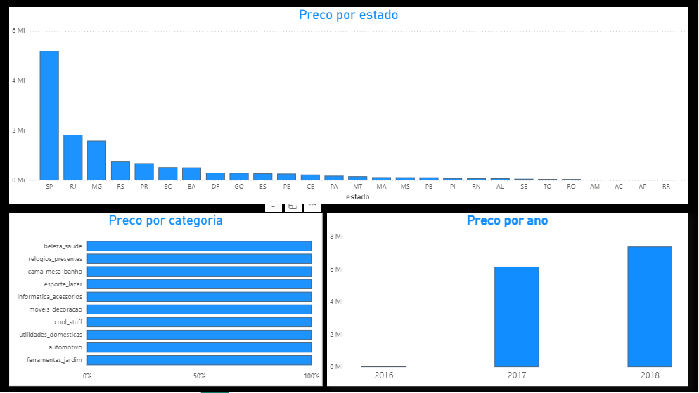

# Pipeline de Dados para E-commerce — do zero ao dashboard

Projeto de portfólio de Engenharia de Dados. A ideia é pegar dados brutos de
um e-commerce real (dataset público da Olist, maior marketplace do Brasil),
construir um pipeline de dados completo e terminar com um dashboard no
Power BI respondendo perguntas de negócio: quanto vendemos, quanto tempo
demora a entrega, e como estão os clientes satisfeitos.

## Por que este projeto existe

Mostrar, na prática, o fluxo de trabalho de um(a) engenheiro(a) de dados:
pegar dado bruto → limpar e organizar → modelar → carregar num banco →
disponibilizar para análise em um dashboard.

## Arquitetura

Kaggle (CSVs) → data/raw/ → Python (ETL) → PostgreSQL → SQL (transformação)
→ esquema estrela
→ Power BI

- **Fonte:** dataset público "Brazilian E-Commerce Public Dataset by Olist" (Kaggle)
- **Armazenamento/Transformação:** PostgreSQL (via Docker) + SQL
- **Orquestração do ETL:** Python (pandas + SQLAlchemy)
- **Visualização:** Power BI Desktop

## Resultados

- **Faturamento total:** R$ 13.591.643,70 (calculado direto do `fato_pedidos`)
- **Crescimento:** salto expressivo de 2016 (ano de lançamento da Olist) para 2017-2018
- **Concentração geográfica:** São Paulo lidera isolado em faturamento, seguido por RJ e MG
- **Top categorias:** beleza_saude, relogios_presentes e cama_mesa_banho no topo do ranking

## Roteiro do projeto

- [x] Etapa 0 — Estruturado projeto e Git
- [x] Etapa 1 — Obter os dados (dataset Olist)
- [x] Etapa 2 — Explorar e entender os dados
- [x] Etapa 3 — Modelagem de dados (esquema estrela)
- [x] Etapa 4 — Pipeline ETL em Python
- [x] Etapa 5 — Transformação em SQL (fato e dimensões)
- [x] Etapa 6 — Qualidade de dados
- [x] Etapa 7 — Dashboard no Power BI
- [x] Etapa 8 — Documentação final e publicação no GitHub
- [] Etapa 9 — Post de divulgação no LinkedIn

## Estrutura de pastas

data/raw/          # CSVs originais baixados do Kaggle (fora do Git)
data/processed/     # dados tratados (fora do Git)
sql/                # scripts SQL de transformação
src/                # scripts Python do pipeline
docs/               # anotações e decisões do projeto

## Status

 Pipeline completo, do dado bruto ao dashboard.

## Autor

Filipe Sousa

